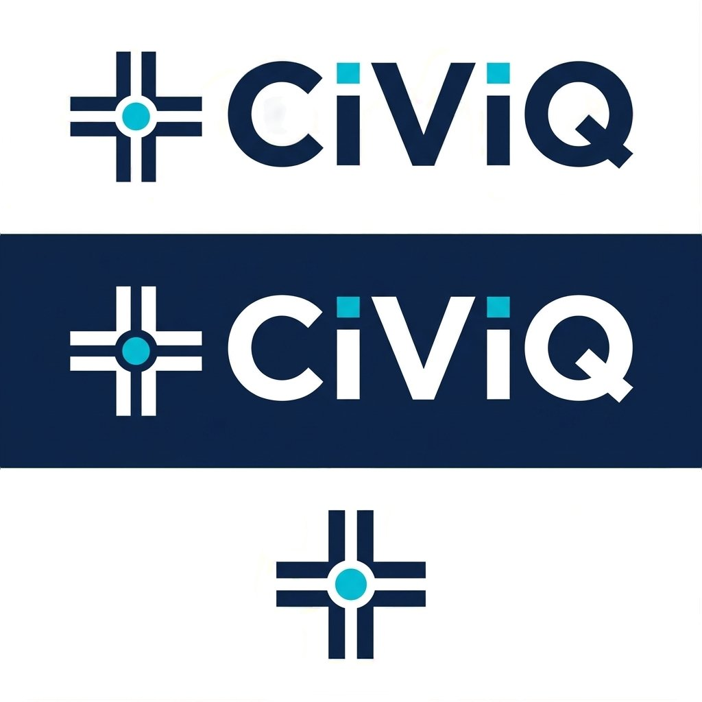

<div align="center">
  
</div>

<div align="center">


</div>

# CiViQ

### City Infrastructure Vision Intelligence Quotient

> Plan together. Build once.

## Description 📝

CiViQ is a **full-stack municipal infrastructure coordination platform** for Indian
city administrations. Its core purpose is to prevent conflicting municipal infrastructure
work from being planned or executed in the same place and timeframe.

When an officer submits a project, the backend runs **automatic clash detection**
against other pending, approved or active projects that match the clash-detection
criteria — a conflict requires geographic proximity, timeline overlap **and** an
incompatible work-type pairing, all three — and records a `Conflict` document for
each pair it finds. Every project is independently ranked by a weighted **MCDM engine**
(seven criteria), so when an administrator resolves a conflict, the system presents
the MCDM scores of the competing projects to support conflict resolution. Around that
core sit role-scoped dashboards, a **Leaflet GIS** layer stack, a citizen complaint
workflow, an **SSE-backed notification system with optional email delivery**, and an
append-only audit trail for privileged business actions.

The platform is built on **JWT authentication**, **role-based access control with
per-record ownership scoping**, a hand-maintained **OpenAPI 3.0.3** contract served
by the application itself, and a **public transparency portal** that citizens use
without creating an account.

- 🔗 **Repository:** https://github.com/kaifcs/CiViQ

There is no hosted deployment of this project; run it locally with the
instructions below.

<hr/>

## Table of Contents

| Section | Description |
| --- | --- |
| [Project Aim](#project-aim-) | 🎯 What CiViQ sets out to solve |
| [Tech Stack](#tech-stack-) | 💻 Technologies and their actual role |
| [Key Features](#key-features-) | ✨ Platform highlights |
| [System Architecture](#system-architecture-) | 🏛️ Layers, flows and services |
| [Role-Based Features](#role-based-features-) | 👥 Citizen, Officer, Supervisor, Administrator |
| [Backend Capabilities](#backend-capabilities-) | ⚙️ API-level behaviour |
| [Security](#security-) | 🔒 Verified security mechanisms |
| [Database Models](#database-models-) | 🗂️ Collections, fields and relationships |
| [API & OpenAPI](#api--openapi-) | 📘 Contract, conventions and docs |
| [Testing & Quality Gates](#testing--quality-gates-) | 🧪 Suites, lint, build |
| [Project Structure](#project-structure-) | 📁 Repository layout |
| [Run Locally](#run-locally-) | 🚀 Setup instructions |
| [Environment Variables](#environment-variables-) | 🔧 Backend and frontend configuration |
| [Application URLs](#application-urls-) | 🌐 Local endpoints |
| [Known Limitations](#known-limitations-) | ⚠️ What the system genuinely does not do |
| [Developer](#developer-) | 👨‍💻 Author |

<hr/>

## Project Aim 🎯

- **Prevent** duplicated municipal excavation by detecting project clashes before
  ground work begins, rather than reporting them afterwards.
- **Rank** competing works objectively with a weighted multi-criteria decision
  model, so conflict resolution rests on a score rather than seniority.
- **Coordinate** citizens, officers, supervisors, and administrators through one
  workflow with centralized records.
- **Expose** approved municipal work publicly, with no account required, while
  keeping internal handling detail redacted from anonymous callers.
- **Record** privileged business actions through an append-only audit trail.

<hr/>

## Tech Stack 💻

Only dependencies that the application actually uses are listed.

### Frontend 🎨

| Technology | Role in CiViQ |
| --- | --- |
| **React 19** | UI layer for the three staff role sections and the public portal |
| **Vite 8** | Dev server and production build, with route-level code splitting |
| **React Router 7** | Route table in `router/AppRouter.jsx`; dashboards eager, the rest `lazy()` |
| **Tailwind CSS 3** | All styling; shared class dictionaries live in `components/uiStyles.js` |
| **Axios** | HTTP client wrapped by `services/apiClient.js`, which injects the JWT |
| **Leaflet 1.9** | Map rendering for every GIS surface |
| **leaflet.markercluster** | Clustered point rendering in `MarkerLayer` |
| **leaflet.heat** | Density surface for the heatmap layer |

State is held by two React contexts (`AuthContext`, `NotificationContext`) plus
local component state — there is no external state library.

### Backend ⚙️

| Technology | Role in CiViQ |
| --- | --- |
| **Node.js + Express 4** | REST API layered `route → middleware → controller → service → model` |
| **Mongoose 8** | ODM for all seven collections; enum values are read back off the schemas |
| **jsonwebtoken** | Session tokens and short-lived SSE stream tickets, signed in one place (`utils/token.js`) |
| **bcryptjs** | Password hashing on the `User` pre-save hook |
| **Helmet** | Secure HTTP response headers |
| **CORS** | Single configured origin, with pagination/correlation headers explicitly exposed |
| **express-rate-limit** | Four independent limiters (global, SSE, auth, public complaint intake) |
| **compression** | gzip response compression |
| **morgan** | Request logging, correlated by request id |
| **swagger-ui-express** | Serves the hand-maintained OpenAPI document at `/api/docs` |
| **redis** *(optional)* | Cross-instance fan-out for the notification stream |
| **dotenv** | Environment loading; required variables are validated at boot |

Transactional email is sent through the **Brevo REST API over native `fetch`** —
there is no provider SDK, SMTP client or job-queue dependency.

### Database 🛢️

- **MongoDB** with **Mongoose 8** — seven collections, each with explicit indexes
  chosen for the specific list, lookup or sweep that reads them.

### Testing 🧪

- **`node:test` and `node:assert`** — Node's built-in runner. **Neither package has a
  test-framework dependency.**
- Backend integration tests run against a real MongoDB; each test file derives its
  own database name and drops it afterwards.

### Tooling / Infrastructure 🛠️

- **ESLint 10** (backend) and **ESLint 9** with the React Hooks and React Refresh
  plugins (frontend)
- **nodemon** for backend development
- **PostCSS + Autoprefixer** for the Tailwind pipeline
- **GitHub Actions** — `.github/workflows/ci.yml` runs lint, build and test for both
  halves as separate jobs, with MongoDB supplied as a service container

<hr/>

## Key Features ✨

- 🔍 **Automatic clash detection** — geographic, timeline and work-type overlap must
  all hold before a conflict is raised
- 📊 **MCDM project scoring** — seven weighted criteria, stored 0–10
- 🗺️ **Six-layer GIS stack** — heatmap, utility, department, project, complaint and
  conflict layers, independently toggleable
- ✏️ **Geometry authoring** — draw `LineString` and `Polygon` corridors on the project
  wizard's Location step
- 🏛️ **Public transparency portal** — approved and active works, browsable with no account
- 📮 **Anonymous complaint intake and tracking** by server-generated CNR reference
- 🔔 **Real-time notifications** over SSE, with optional Brevo email delivery
- 🧾 **Append-only audit trail** of every privileged action
- 📈 **Administrator analytics** with CSV export
- 🔐 **Role-based access control** with per-record project ownership scoping
- 📘 **OpenAPI 3.0.3 contract** served by the application itself

<hr/>

## System Architecture 🏛️

CiViQ is two independent npm packages with **no workspace root**: `backend/`
(Express + Mongoose, CommonJS) and `frontend/` (React + Vite, ESM). Every command
runs from inside one of them.

```
Browser (React 19 + Vite)
   │  Axios, JWT in the Authorization header
   ▼
services/apiClient.js  ──►  services/adapters.js   (backend → view-model projection)
   │
   ▼  HTTP  /api/*
Express pipeline (src/app.js)
   requestContext → helmet → cors → compression → body parsers
                  → rate limiters (global · SSE · auth · complaint intake)
                  → routers → notFound → errorHandler
   │
   ▼
routes/  ──► middleware/ (protect · authorize · ownership) ──► controllers/
                                                                   │
                                                                   ▼
                                                              services/
                                          clashDetection · clashSync · mcdmEngine
                                          notificationService · auditService
                                          emailService · notificationStream · analytics
                                                                   │
                                                                   ▼
                                                          models/ (Mongoose)
                                                                   │
                                                                   ▼
                                                              MongoDB
```

### Frontend architecture

`src/router/AppRouter.jsx` is the route table, organised into role-prefixed
sections (`/admin`, `/officer`, `/supervisor`) plus the unauthenticated citizen
routes. Dashboards and login load eagerly; everything else is `lazy()`, and the map
routes specifically so Leaflet stays off the critical path.

`src/services/` is the contract boundary. `apiClient.js` injects the JWT, and on a
401 clears the session and dispatches a `civiq:auth-expired` event rather than
importing `AuthContext` directly. **All backend→view-model projection lives in
`adapters.js`** — enum casing, the conflict vocabulary rename, the MCDM 0–10 → 0–100
conversion, and `UNAVAILABLE_FIELDS` for UI fields with no backend source.

Four shared modules exist so nothing is redeclared per screen:

| Module | Owns |
| --- | --- |
| `components/dashboard` | charts, sortable tables, filters, CSV export, formatters, status **labels** |
| `components/uiStyles.js` | status / department / type / role **Tailwind classes** |
| `components/notifications` | list, item and dropdown, all reading one provider via `useNotificationCenter` |
| `src/gis` | Leaflet primitives, layer styles and configuration, marker **colours** |

Client-side route guards are **UX only**; real enforcement is backend RBAC.

### Backend architecture

`src/app.js` is the whole pipeline and its order is load-bearing: `requestContext`
first so every log line — including Morgan's — carries the request id, then the
security and parsing middleware, then four separate rate limiters, then the
routers, with `notFound` and `errorHandler` last.

Controllers own request/response and validation; services own cross-cutting
business logic and are the only writers to their domain.
`src/utils/apiResponse.js` is the single source of truth for response shapes.

### Authentication flow

1. `POST /api/auth/login` verifies the credential with bcrypt against an account
   that must be `isActive`, stamps `lastLogin`, and returns a JWT.
2. The token payload carries **only the user id** — never a role, because a role
   inside the token would outlive a role change.
3. `middleware/auth.js` `protect` re-reads the user from the database on **every**
   request, so a deactivation or role change takes effect immediately.
4. `logout` is a client-side token discard; JWTs have no server-side revocation state.

### Authorization / RBAC

Two layers, deliberately separated:

- **`authorize(...roles)`** — coarse-grained: may this role use this endpoint at all.
- **`middleware/ownership.js`** — per-record project scoping. `projectScopeFilter`
  (list), `canAccessProject` (predicate) and `requireProjectAccess` (route guard)
  are three views of one rule, so the list and single-resource routes cannot drift
  apart. It **fails closed** — any role beyond the three named matches nothing —
  and returns **404, not 403**, for an inaccessible id so ids cannot be probed.

Complaints intentionally carry **no** ownership filter: assignment is operational
routing, not access control.

### Project & conflict flow

```
officer creates project (status: pending)
        │
        ├─► mcdmEngine        → mcdmScore (0–10) + mcdmBreakdown
        └─► clashDetection    → candidate search (ward OR bounding box)
                                → exact haversine distance vs. combined type/size buffer
                                → timeline overlap
                                → work-type compatibility matrix
                                → Conflict document per clashing pair
                                → clashSync reconciles hasClash / clashes[] on both projects
        │
admin approves / rejects, or resolves the conflict
   approve_both  → coordination note
   reject_lower  → the lower-MCDM project is rescheduled, awaiting its officer
        │
officer responds (accept the suggested date, or propose a custom one)
        │
supervisor reports progress on approved/active work → completion
```

Clash detection only re-runs when an update touches a field it reads
(`location`, `startDate`, `endDate`, `projectType`); MCDM likewise
(`mcdmInputs`, `startDate`, `projectType`, `location`).

### Complaint flow

```
citizen (no account) → POST /api/complaints  → server-generated CNR, status "submitted"
                     → GET /api/complaints/:id?cnr → redacted public tracking view
staff → PATCH /:id/assign   (admin, officer)
      → PATCH /:id/status   (admin, officer, supervisor)  → notifications on both
```

### Notification flow

`notificationService` is the sole reader **and** writer of notifications —
controllers hold no notification queries.

```
business operation → persistence → preference evaluation → in-app (SSE) / email
```

Persistence is never gated on preferences, so history stays complete even for a
muted category. The notification row itself doubles as the email retry queue
(`deliveryStatus`, `retryCount`, `nextAttemptAt`), so no broker is involved; the
`sending` claim is taken atomically, which prevents a duplicate send when several
instances sweep at once.

### Audit flow

`auditService.recordAudit` is the only writer to `AuditLog`, called from inside the
business operation it describes. It is **best-effort**: a failure is logged and
swallowed, never surfaced, so recording can never turn a completed action into an
error response. Guards run *before* writes, so a rejected request produces no
audit entry.

### External services

Both are optional and degrade cleanly when their variables are absent:

| Service | When configured | When absent |
| --- | --- | --- |
| **Brevo** (email) | Notification emails are delivered and retried | Notifications still persist and stream; delivery is marked `skipped` |
| **Redis** | Stream events fan out across instances | The hub stays process-local and behaves identically for a single instance |

<hr/>

## Role-Based Features 👥

There are exactly **three account roles** — `admin`, `officer` and `supervisor`.
**There is no citizen account type**: every citizen surface is unauthenticated, so
a resident never signs in. All permissions below are taken from the backend routers
and `middleware/ownership.js`, not from frontend visibility.

### 🧍 Citizen — no account, no login

- **Browse approved work** — `/` and `/home` render the landing page; `/projects` and
  `/projects/:id` list and detail projects the city has approved, started, finished
  or rescheduled. Served by `GET /api/projects/public` and `/public/:id`, which
  return a whitelisted projection with no officer, supervisor, MCDM or conflict
  fields. Pending and rejected work never appears.
- **File a complaint** — `/complaints/new`. Issue type and description are required,
  and the location is placed by clicking the map because `location.coords` is
  schema-required. Ward is chosen from `GET /api/config/wards`, so a reported ward
  always matches the register the backend reasons about. The server-generated **CNR**
  is shown only on a 201, never optimistically.
- **Track a complaint** — `/complaints/track?cnr=…`. `GET /api/complaints/:id` accepts a
  CNR in place of an id, and shows the status timeline and the reporter's own
  description.
- **Cannot** see any handling detail: `assignedOfficer`, `assignedDepartment`,
  `photoUrl`, `resolutionNote`, `location.coords` and `location.address` are stripped
  for an unauthenticated caller.

### 👷 Officer

- **Create projects** — `POST /api/projects` (officer, admin). The multi-step wizard at
  `/officer/projects/new` collects details, MCDM inputs, location and geometry.
- **Edit own projects** — `PUT /api/projects/:id`, gated by `requireProjectAccess`, so
  only projects where `officer === self` are reachable. Another officer's project id
  returns 404.
- **View own projects** — list and detail are both scoped to `{ officer: self }`.
- **Respond to conflicts** — `PUT /api/conflicts/:id/respond` (officer only): accept the
  suggested date or propose a custom one.
- **Complaints** — view the complaint list and detail, update status, and assign
  (`PATCH /:id/assign` is restricted to admin and officer).
- **Map** — `/officer/map` with the full GIS layer stack.
- **Settings** — own profile and password only.
- **Cannot** approve or reject projects, resolve conflicts, manage users or
  departments, read the audit trail, or open the analytics dashboard.

### 🧭 Supervisor

- **View assigned projects** — scoped to `{ supervisor: self }` by the same ownership rule.
- **Report progress** — `PUT /api/projects/:id/progress` is **supervisor-only** and
  ownership-scoped; progress applies only to `approved` and `active` projects.
  This is the one role that can drive a project to completion.
- **Edit assigned projects** — `PUT /api/projects/:id`, within the same ownership scope.
- **Update complaint status** — `PATCH /api/complaints/:id/status`. Supervisors are
  **not** in the assignment roles, so they cannot route a complaint to a department
  or officer.
- **Settings** — own profile and password only.
- **Cannot** create projects, approve or reject, respond to conflicts, or reach any
  admin-only router.

### 🛡️ Administrator

- **Unrestricted project access** — `projectScopeFilter` returns `{}` for an admin, so
  every project is visible; approve (`PUT /:id/approve`), reject (`PUT /:id/reject`)
  and status changes (`PATCH /:id/status`) are admin-only.
- **Resolve conflicts** — `PUT /api/conflicts/:id/resolve` (admin only), choosing
  `approve_both` with a coordination note or `reject_lower`, with an override
  category, reason and reference recorded on the conflict.
- **User management** — the entire `/api/users` router is admin-only: list, read, update
  (name, phone, avatar, role, department) and activate/deactivate via `/:id/status`.
  Accounts are **deactivated, never deleted**, so referencing history stays readable.
- **Account creation** — `POST /api/auth/register` requires an admin session and can
  create only `officer` and `supervisor`; administrators must be promoted in a
  separate step.
- **Department management** — create, update and activate/deactivate. Reads are open to
  any authenticated role, because departments are referenced by id elsewhere.
- **Analytics** — the entire `/api/dashboard` router is admin-only: summary, projects,
  conflicts, complaints, departments and activity, reported municipality-wide.
  CSV export is available on the Analytics and Audit screens.
- **Audit trail** — `/api/audit` is admin-only and read-only.
- **Complaints** — full detail, assignment and status changes.

<hr/>

## Backend Capabilities ⚙️

- 🧮 **MCDM engine** — seven weighted criteria totalling 1.0: condition severity (26%),
  population impact (21%), seasonal compatibility (16%), execution readiness (16%),
  citizen disruption (10%), infrastructure age (8%), economic value (3%). Scores are
  stored 0–10 and converted to 0–100 by the frontend adapter. Condition severity
  incorporates the ward's complaint volume over the previous 180 days.
- 💥 **Clash detection** — candidates are pre-filtered by ward *or* a bounding box sized
  to the widest buffer any two projects could combine to, then measured with exact
  haversine distance against a per-type and per-size buffer, then checked for timeline
  overlap and finally against the work-type compatibility matrix. Only projects with
  status `pending`, `approved` or `active` are considered.
- 🔗 **Conflict reconciliation** — `clashSync` rewrites `hasClash` and `clashes[]` on both
  sides of a pair together; the `Conflict` collection stays authoritative.
- 🔔 **Notifications** — eight business events raise notifications: project approved,
  rejected, assigned and completed; clash detected; complaint assigned and status
  changed; and role changed. Category and priority are derived from the type, so an
  event is always classified the same way.
- 📡 **Server-Sent Events** — `EventSource` cannot set headers, so the stream is opened
  with a **30-second, single-use ticket** exchanged for a Bearer header inside the
  route, keeping account state and RBAC on the one `protect` pipeline. Missed events
  are recovered by re-reading over REST; there is no server-side replay queue.
- 📧 **Email retry** — 429 and 5xx responses retry with backoff; other 4xx are permanent.
- 📄 **Pagination** — opt-in via `?page`/`?limit`, reported through the
  `X-Total-Count` header family, which CORS explicitly exposes.
- 🩺 **Health endpoint** — `GET /api/health` reports uptime, database state and each
  subsystem as `connected`, `configured` or `disabled` — never a host, URI or credential.
- 🆔 **Request correlation** — every request carries an id, echoed in `X-Request-Id` and
  present on every log line including Morgan's.
- 🌱 **Seeding** — `npm run seed` loads a full demo municipality (10 departments,
  10 accounts, 10 projects, complaints, conflicts, notifications and audit logs).

<hr/>

## Security 🔒

Every item below is enforced in backend code.

| Mechanism | Implementation |
| --- | --- |
| **Authentication** | Bearer JWT signed in one place (`utils/token.js`), which also verifies stream tickets — one key, one verification path |
| **Immediate revocation of access changes** | `protect` re-reads the user on every request; a deactivated account or changed role takes effect at once, and the token carries no role to go stale |
| **Password hashing** | bcrypt (10 rounds) on the `User` pre-save hook, guarded by `isModified` so an unrelated save cannot re-hash |
| **Password hash withheld** | Three independent layers: `select: false` on the field, `.select("-password")` on reads, and a `toJSON` that deletes it — no single mistake exposes it |
| **RBAC** | `authorize(...roles)` applied in the routers, never inside controllers |
| **Ownership scoping** | `middleware/ownership.js`, fail-closed (`$nor: [{}]`, so it cannot be cancelled out by a later `_id` spread) |
| **Reduced enumeration exposure** | An inaccessible project returns **404, not 403**; login returns one identical message for an unknown email, a wrong password and an inactive account |
| **Input validation** | Credential fields are type-checked as strings before any string method or bcrypt call, so an array that coerces to a valid email is still rejected; scalar query filters are validated against schema enums so `?status[$ne]=x` cannot reach Mongo as an operator |
| **Write whitelisting** | `utils/writableFields.js` picks permitted fields per route. Public complaint creation accepts only issue type, description, location and photo URL — workflow state and assignment are unreachable from the public form |
| **Privilege escalation constrained at registration** | `POST /api/auth/register` is admin-only and constrained to `officer` and `supervisor`, so no single request both creates a principal and grants it unrestricted access |
| **Self-service scope** | Profile updates are limited to `fullName`, `phone`, `avatar` — deliberately narrower than the admin whitelist, so `role`, `department` and `isActive` are unreachable from self-service |
| **Password change** | Requires the current password; no account can change another user's |
| **Self-deactivation protection** | An administrator cannot deactivate their own account |
| **Self-demotion protection** | An administrator cannot change their own role away from `admin`, even when others remain |
| **Last-active-admin protection** | Any role change or deactivation that would leave zero active administrators is refused; the check excludes the target, so it asks "would any administrator survive this" |
| **Sensitive field redaction** | Complaint reads strip assignment, photo, resolution note and precise location for unauthenticated callers, and the `?department`/`?assignedOfficer` filters are ignored without a session so redaction cannot be reversed by filtering for a match |
| **Rate limiting** | Four independent limiters: 1000 per 15 min globally on `/api`; 30 per min on the SSE stream (which the global limiter skips, so a flapping network cannot drain the ordinary allowance); 20 per 15 min on login/register/password, counting failures only; 10 per hour on public complaint creation |
| **Security headers** | Helmet on every response |
| **CORS** | A single configured origin, with only the pagination and correlation headers explicitly exposed |
| **Proxy trust** | Off unless `TRUST_PROXY` is set, so `req.ip` — and therefore rate limiting and the recorded audit address — cannot be spoofed by a caller-supplied header |
| **SSE credential exposure** | 30-second single-use tickets instead of the session JWT; a consumed ticket is refused, and a session JWT is not accepted as a ticket |
| **Audit trail** | Append-only, written only by `auditService`, from inside the operation it describes; guards run before writes so refused operations record nothing, and credentials never enter the trail |
| **Error uniformity** | One envelope for every failure, with `details` stripped in production |

<hr/>

## Database Models 🗂️

Seven MongoDB collections, all defined in `backend/src/models/`.

### `User`
Staff accounts. **Purpose:** authentication and role assignment.
- `fullName`, `email` (unique, lowercased), `password` (hashed, `select: false`, min 8)
- `role` — `admin` | `officer` | `supervisor`
- `department` (String — deliberately **not** a ref, so it cannot be populated),
  `phone`, `avatar`, `isActive`, `lastLogin`, `notificationPreferences`

### `Department`
The owning body for projects and complaints.
- `name` (unique), `code` (unique, uppercased), `description`, `color`, `isActive`
- **Deactivated, never deleted** — existing projects reference them and history must
  stay readable. `isActive` is what the reference validators check.

### `Project`
The central entity.
- `title`, `projectId` (unique, server-generated `PRJ-####`), `description`
- `department` → **ref `Department`** (required); `officer` and `supervisor` →
  **ref `User`**, both driving visibility; `createdBy` → **ref `User`** (required);
  `projectManager` → ref `User`
- `projectType` — `road` | `water` | `sewage` | `electricity` | `parks` | `other`
- `status` — `pending` | `approved` | `rejected` | `active` | `completed` | `rescheduled`
  (workflow state; `isActive` is a **separate** soft-delete flag)
- `startDate`, `endDate`, `actualEndDate`, `progress`, `priority`
- `location` — ward, zone, road name, `centerCoords` (schema-validated latitude and
  longitude bounds, required) and `geoJSON` for drawn corridors
- `mcdmScore`, `mcdmBreakdown`, `mcdmInputs`
- `hasClash` and `clashes[]` → **ref `Conflict`** — derived from the `Conflict`
  collection, which stays authoritative; both sides of a pair are rewritten together
- Budget and tender fields, `documents[]`, `parentProject` → ref `Project`, `phaseNumber`

### `Conflict`
A detected collision between two projects.
- `project1`, `project2` → **ref `Project`** (both required)
- `pairKey` — canonical sorted key making (A,B) and (B,A) identical, recomputed on
  validate and **never client-supplied**, with a **unique index** so concurrent
  detection cannot create duplicate conflicts
- `clashTypes[]` — `geographic` | `timeline` | `worktype`
- `severity` — `incompatible` | `conditional`
- `status` — `pending` | `resolved_both` | `resolved_rejected` | `awaiting_officer`
- `adminResolution` and `officerResponse` are kept as **separate sub-documents**, so
  the record preserves who decided what
- `suggestedDate`, `recheckPassed`, `rescheduledProject` → ref `Project`

### `Complaint`
A citizen-reported issue.
- `cnrId` — unique public tracking reference, server-generated `CNR-######`
- `issueType` — `pothole` | `streetlight` | `water_leak` | `garbage` | `drainage` | `other`
- `description` (required), `location.coords` (required, bounds-validated),
  `location.ward`, `location.address`, `photoUrl`
- `status` — `submitted` | `acknowledged` | `in_progress` | `resolved` (terminal)
- `assignedOfficer` → **ref `User`**; `assignedDepartment` is a **String, not a ref**,
  so joining it needs `$convert`
- Ward history feeds the MCDM condition score, which is why `{ location.ward, createdAt }`
  is indexed

### `Notification`
- `recipient` → **ref `User`** (required), `type` (closed enum of nine), `title`,
  `message`, `link`, `data`
- `category` and `priority` are **derived from `type` at creation**, so callers cannot
  classify the same event two ways
- `read`/`readAt`, `archived`/`archivedAt` — archive is the soft-delete: the row leaves
  the feed but stays in history
- `deliveryStatus` (`pending` | `sending` | `delivered` | `failed` | `skipped`),
  `retryCount`, `nextAttemptAt`, `lastError` — **the row is the email retry queue**

### `AuditLog`
- `action`, `performedBy` → **ref `User`**, `targetType`, `targetId`, `details`,
  `isOverride`, `ipAddress` (from `req.ip`, so only as trusted as `TRUST_PROXY` says)
- Indexed newest-first, and by actor

**Identifier caveat.** `projectId` and `cnrId` are derived from a document count, so
concurrent creates can collide; the **unique index is what ultimately rejects a
duplicate**.

<hr/>

## API & OpenAPI 📘

- **Base path:** `/api`
- **Authentication:** Bearer JWT in the `Authorization` header
- **Authorization:** role-based, and ownership-scoped for projects

Interactive documentation is served by the backend itself:

| Endpoint | Purpose |
| --- | --- |
| `GET /api/docs` | Swagger UI |
| `GET /api/docs.json` | OpenAPI 3.0.3 document |
| `GET /api/health` | Liveness, database state and subsystem diagnostics |

The specification is **hand-maintained** in `backend/src/openapi/` and currently
describes **52 paths / 62 operations** across auth, config, departments, users,
projects, conflicts, complaints, notifications, audit and dashboard. Adding or
changing a route means updating `openapi/paths.js` too.

### Resource groups

| Router | Access |
| --- | --- |
| `/api/auth` | `login` public; `register` admin-only; `me`, `profile`, `password`, `logout` authenticated |
| `/api/config` | `wards` public |
| `/api/projects` | `public` and `public/:id` unauthenticated; the rest authenticated and ownership-scoped |
| `/api/conflicts` | Authenticated; `resolve` admin-only, `respond` officer-only |
| `/api/complaints` | List, detail, stats and create are public; update, status and assign are role-gated |
| `/api/departments` | Reads authenticated; writes admin-only |
| `/api/users` | Admin-only |
| `/api/audit` | Admin-only, read-only |
| `/api/dashboard` | Admin-only, read-only |
| `/api/notifications` | Authenticated, always scoped to the recipient |

### Response conventions

**Errors are uniform.** Every failure returns:

```json
{ "success": false, "error": { "code": "...", "message": "...", "details": "..." }, "message": "..." }
```

`message` is repeated at the top level so both historical error shapes remain valid
subsets, `error.code` is a stable identifier suitable for branching, and `details` is
stripped in production.

**Success payloads are deliberately not uniform.** Auth, departments, users and
dashboard wrap in `{ success, ... }`; projects, conflicts, complaints, audit and
notifications return the raw document or array, which the frontend adapters read
directly. The spec documents this as-is — converging it would break every existing
consumer.

Deeper design notes live in [`docs/`](docs/): `api/API_REFERENCE.md`,
`architecture/`, `features/` (MCDM, GIS, notifications, audit logging,
authorization) and `deployment/`.

<hr/>

## Testing & Quality Gates 🧪

Both halves expose the same scripts, and `check` is what CI runs.

| Script | Backend | Frontend |
| --- | --- | --- |
| `npm run lint` | ESLint — **clean, 0 problems** | ESLint — **clean, 0 problems** |
| `npm run build` | `node --check server.js` (syntax) — **passing** | Vite production build — **passing** |
| `npm test` | **294 tests** | **59 tests** |
| `npm run check` | lint + build + test | lint + build + test |
| `npm run test:coverage` | with coverage report | with coverage report |

### Verified results

Last run against this repository, with a local MongoDB reachable:

| Suite | Tests | Pass | Fail | Skipped |
| --- | --- | --- | --- | --- |
| Backend (`backend/`) | 294 | 294 | 0 | 0 |
| Frontend (`frontend/`) | 59 | 59 | 0 | 0 |

Backend coverage spans 13 unit files (response envelope, error middleware, logger,
notification links, preferences and stream, ownership, pagination, seed audit
actions and credentials, serializers, stream tickets, validators) and 8 integration
files (admin lockout, the API surface, clash detection, complaint self-notification,
conflict pair uniqueness, input type safety, notification filtering, project geometry
and restore). The frontend suite covers adapters, GIS primitives, hook dependency
metadata and workflow vocabularies.

### Running a single file or test

```bash
# backend
node --import ./test/setup.js --test test/unit/pagination.test.js
node --import ./test/setup.js --test --test-name-pattern "clash" test/integration/clashDetection.test.js

# frontend
node --import ./test/setup.mjs --test test/adapters.test.js
```

### How the suites work

Tests use Node's built-in runner (`node:test`) — **there is no test framework
dependency in either package.** Backend integration tests need a MongoDB and
**skip with a stated reason** when none is reachable, so `npm test` still works on a
machine without one; `.github/workflows/ci.yml` supplies MongoDB as a service so
those tests always execute in CI.

`TEST_MONGODB_URI` overrides the test database (default
`mongodb://127.0.0.1:27017/civiq_test_s5`). It is **never** read from `MONGODB_URI`, and
each test file derives its own database name and drops it afterwards — the configured
development database is never touched.

The frontend test setup is a single ESM resolve hook that appends the extension Vite
would have resolved. There is **no JSX transform in tests**, so only plain-`.js` modules
(adapters, GIS, hook metadata) are testable; component tests would require additional
tooling.

<hr/>

## Project Structure 📁

```
.github/workflows/   CI: lint, build and test for both halves
docs/                architecture, feature and deployment notes
backend/
  server.js          process lifecycle: env validation, connections, listen, shutdown
  src/
    app.js           the Express pipeline (middleware order, routes, error chain)
    config/          env validation, DB and optional Redis connections, policy constants
    controllers/     request handling per module
    services/        clash detection, MCDM scoring, analytics, audit, notifications, email
    models/          Mongoose schemas
    routes/          Express routers (auth guards applied here)
    middleware/      auth, ownership scoping, request correlation, error handling, 404
    utils/           validators, pagination, tokens, response helpers, logger, serializers
    openapi/         OpenAPI specification
    scripts/         one-off maintenance scripts
    seed/            demo data (DESTRUCTIVE — see the header in seed/index.js)
  test/
    unit/            hermetic tests; no database required
    integration/     API, notification feed and clash detection against MongoDB
    helpers/         response doubles, fixtures, per-file test database
frontend/
  test/              adapter, GIS and hook tests, plus the ESM resolve hook
  src/
    gis/             GIS module (primitives, layers, styles, configuration)
    services/        API client and backend -> view-model adapters
    hooks/           data-fetching and settings hooks
    context/         authentication and notification state
    pages/           admin / officer / supervisor / citizen screens
    router/          the route table
    components/      shared UI
      dashboard/     charts, tables, filters, CSV export, formatters
      notifications/ notification list, item and navbar dropdown
      uiStyles.js    Tailwind class dictionaries shared by list/detail screens
```

<hr/>

## Run Locally 🚀

### Prerequisites

- **Node.js** and **npm** — CI builds and tests on Node 24; no `engines` range is declared
- A **MongoDB** instance (local or hosted)
- Optional: a **Brevo** account for email, and **Redis** for multi-instance streaming

### Clone

```bash
git clone https://github.com/kaifcs/CiViQ.git
cd CiViQ
```

There is **no workspace root** — install and run each half separately.

### Backend

```bash
cd backend
npm install
cp .env.example .env      # then fill in MONGODB_URI and JWT_SECRET
npm run seed              # optional demo data — DESTRUCTIVE, see below
npm run dev               # http://localhost:5000
```

> ⚠️ **`npm run seed` deletes every notification, audit log, conflict, complaint,
> project, user and department** in the database named by `MONGODB_URI` — all seven
> collections, not just the demo accounts — before inserting its fixtures. Never point
> it at a database whose contents matter.

### Frontend

```bash
cd frontend
npm install
cp .env.example .env      # VITE_API_URL must point at the backend
npm run dev               # http://localhost:5173
```

### Quality gates

```bash
npm run lint              # both halves
npm run build             # backend: syntax check · frontend: production build
npm test                  # both halves
npm run check             # lint + build + test — what CI runs
```

### Backend-only scripts

```bash
npm start                          # production start
npm run lint:fix                   # ESLint with --fix
npm run migrate:conflict-pairkey   # backfill pairKey on pre-existing conflicts
```

### Demo Login

Created by `npm run seed` — ten accounts in all: one admin, two supervisors and seven
officers, one per department.

| Role | Email | Password |
| --- | --- | --- |
| Admin | rajesh.kumar@civiq.in | civiq123 |
| Supervisor | suresh.singh@civiq.in | civiq123 |
| Supervisor | anjali.verma@civiq.in | civiq123 |
| Officer | amit.sharma@civiq.in | civiq123 |
| Officer | mohan.kumar@civiq.in | civiq123 |
| Officer | vinay.pandey@civiq.in | civiq123 |

See `backend/src/seed/index.js` for the full list. Seeded accounts carry a real
Department reference, so their department resolves in the UI and a seeded officer can
create a project without naming one explicitly. Accounts created through
**Users → New user** behave identically.

> **Account creation is administrator-only.** There is no public sign-up:
> `POST /api/auth/register` requires an admin session and can create only `officer` and
> `supervisor` accounts — promote to `admin` afterwards via **Users → *user* → Role**.
> Because every account-creating path needs an existing administrator, the first one
> comes from `npm run seed` in development, or a direct database insert in production.

<hr/>

## Environment Variables 🔧

Both packages ship a `.env.example`. Never commit real values.

### `backend/.env`

**Required** — validated at boot; the server logs the missing names and exits if any is absent.

| Variable | Description |
| --- | --- |
| `PORT` | API port, e.g. `5000` |
| `MONGODB_URI` | `<your-mongodb-uri>` — the database the app reads and writes |
| `JWT_SECRET` | `<long-random-value>` — signs both session tokens and SSE stream tickets; changing it invalidates every issued token |
| `JWT_EXPIRES_IN` | Session lifetime, e.g. `7d` |

**Also read**

| Variable | Description |
| --- | --- |
| `NODE_ENV` | Switches log format and strips `error.details` from responses in `production` |
| `CLIENT_URL` | CORS origin; defaults to `http://localhost:5173` |

**Optional** — each degrades cleanly when absent.

| Variable | Effect when unset |
| --- | --- |
| `BREVO_API_KEY`, `MAIL_FROM_EMAIL`, `MAIL_FROM_NAME` | Notifications persist and stream; no email is sent |
| `REDIS_URL` | The notification stream stays process-local instead of fanning out across instances |
| `TRUST_PROXY` | No proxy is trusted. Set it to the proxy hop count when running behind one, or `req.ip` — and therefore rate limiting and the audit trail's recorded address — resolves to the proxy rather than the caller |

**Test-only**

| Variable | Description |
| --- | --- |
| `TEST_MONGODB_URI` | Integration-test database; defaults to `mongodb://127.0.0.1:27017/civiq_test_s5` and is never read from `MONGODB_URI` |

### `frontend/.env`

| Variable | Description |
| --- | --- |
| `VITE_API_URL` | Backend base URL **including** the `/api` prefix, e.g. `http://localhost:5000/api`. Read at build time by Vite, so changing it requires a restart |

<hr/>

## Application URLs 🌐

| Surface | URL |
| --- | --- |
| Frontend | http://localhost:5173 |
| Backend API | http://localhost:5000/api |
| Swagger UI | http://localhost:5000/api/docs |
| OpenAPI document | http://localhost:5000/api/docs.json |
| Health check | http://localhost:5000/api/health |

Public entry points need no account: `/` and `/home` (portal), `/projects` and
`/projects/:id` (approved work), `/complaints/new` and `/complaints/track`. Staff sign
in at `/login`, reachable from the portal header's "Staff Login" action, and are routed
to their role's dashboard.

<hr/>

## Known Limitations ⚠️

Things the system genuinely does not do. Each is a missing data source or an undefined
requirement, not an unfinished screen.

**Two MCDM criteria are not measured.** `populationImpact` (21% of the weight) and
`economicValue` (3%) have no data source: there is no ward population register, no
benefit valuation, and neither is collected from the officer. The engine assigns both
the neutral mid-scale value for every project, so they separate no two projects and
change no ranking — the outcome is decided by the five criteria that are computed. They
are shown in the UI with their weight and labelled *not measured*, and their bars stay
empty, so the constant is never presented as a measurement. Inventing figures would
corrupt 24% of the weight with fabricated data, and the weights are not adjusted to
hide the gap.

**Complaints have no deadline model.** There is no due date, target date or SLA on
`Complaint`, so an overdue state cannot be derived; elapsed time since filing is shown
instead. Adding overdue means first deciding what a deadline is — a policy question,
not a code change.

**Some fields are API-only.** `documents[]`, `parentProject` and `phaseNumber`
(projects) and `photoUrl` (complaints) are legitimate domain fields, writable and
readable through the API and documented in the OpenAPI spec, but no screen reads or
writes them. `documents[]` and `photoUrl` would both need a file upload and storage
service that this deployment does not have. They are retained on the API rather than
removed; `photoUrl` stays reachable through `_raw`. `avatar` (users) *is* consumed, by
`Avatar`, and is set through the API rather than an upload UI.

**One notification type has no producer.** `Notification.type` is a closed enum of nine
values; `early_completion` is defined and reserved but nothing raises it.

**Sessions cannot be revoked server-side.** JWTs carry no revocation state, so a password
change leaves the current device signed in until the token expires. Deactivating the
account *is* immediate, because `protect` re-reads the user on every request.

**Component tests are not possible without more tooling.** The frontend test setup has no
JSX transform, so only plain-`.js` modules are covered.

**The admin shell is desktop-only.** It targets widths ≥1024px. The sidebar collapses to
an icon rail, but the layout is not designed for narrow viewports, so the map has little
room below that width.

<hr/>

## Support ⭐

If you found this project useful, consider giving it a **⭐ Star** on GitHub.

## Developer 👨‍💻

**Kaif Khan | Md Arsalan | Md Ayan Hashmi | Karan Kapil**

Built with the **MERN stack** — React 19, Express 4, MongoDB and Node.js.
